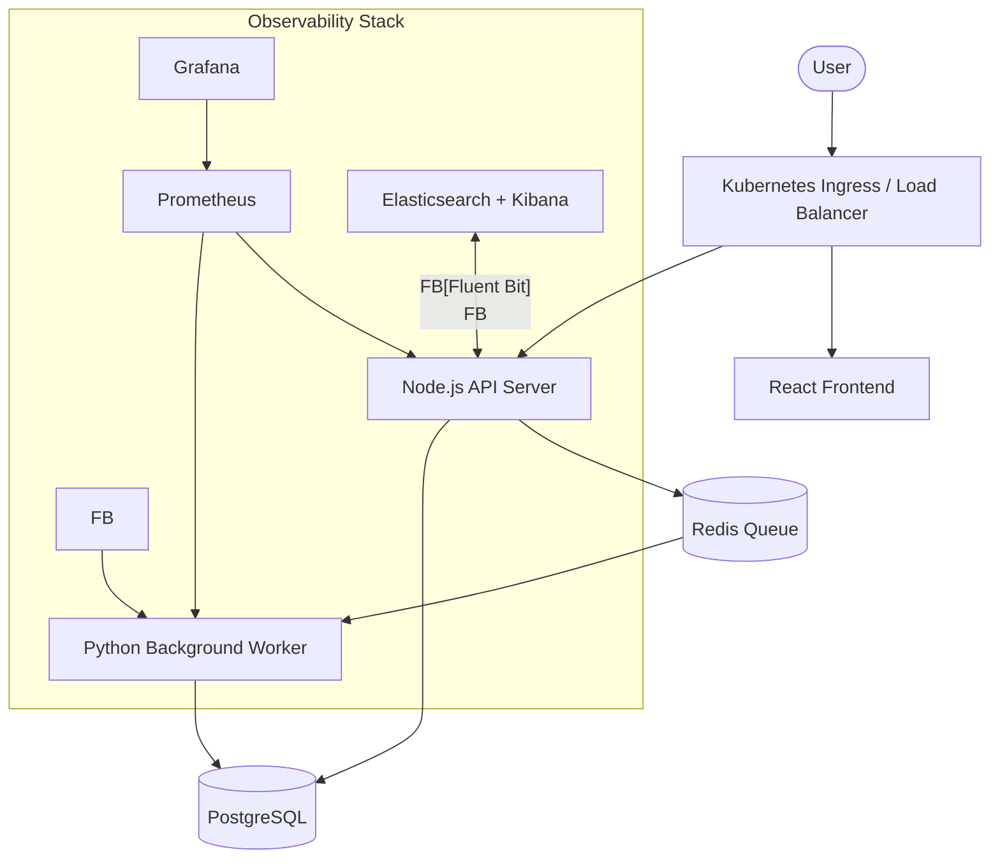

# TaskFlow: High-Availability Cloud-Native SaaS Platform (SRE Sandbox)

[](https://github.com/MenukaPerera42/Production-Grade-Cloud-Native-SaaS-Platform-with-Full-SRE-Stack/actions)

**TaskFlow** is a production-grade, microservices-based SaaS platform engineered as a sandbox for advanced **Site Reliability Engineering (SRE)** and **DevOps** practices. It moves beyond a simple "Hello World" to demonstrate real-world infrastructure complexity, automated lifecycle management, and deep observability.

---

## 🏗️ Architecture Overview

The platform is built on a decoupled, event-driven architecture designed for horizontal scalability and fault tolerance.



## 🚀 Key SRE Features

*   **Infrastructure as Code (Terraform)**: Fully automated AWS provisioning (VPC, EKS, ECR, IAM) using modular, reusable patterns.
*   **Automated CI/CD**: End-to-end GitHub Actions pipelines for automated testing (Jest/Supertest), linting (ESLint), Docker image versioning (SHA-tagging), and Kubernetes rollouts.
*   **Observability (Prometheus & Grafana)**: Pre-configured dashboards monitoring the **4 Golden Signals** (Latency, Traffic, Errors, and Saturation).
*   **Centralized Logging (ELK Stack)**: Structured JSON logging with **Distributed Request Correlation IDs** for rapid root-cause analysis.
*   **Self-Healing & Scaling**: Kubernetes-native HPA (Horizontal Pod Autoscaler) and automated liveness/readiness probes.
*   **Fault Injection Framework**: Built-in capability to simulate high latency, memory leaks (OOM), and error spikes to test alerting and incident response.

## 🛠️ Tech Stack

| Component | Technology |
| :--- | :--- |
| **Backend** | Node.js (Express), Python (Worker) |
| **Frontend** | React, Vite |
| **Data Stores** | PostgreSQL, Redis |
| **Containerization** | Docker, Multi-stage builds |
| **Orchestration** | Kubernetes (EKS), Kustomize |
| **IaC** | Terraform (AWS) |
| **CI/CD** | GitHub Actions |
| **Observability** | Prometheus, Grafana, ELK (Elasticsearch, Fluent Bit, Kibana) |

## 📊 Observability in Action

> [!NOTE]
> *Screenshots below show real-time metrics during a simulated failure incident.*

| Latency Spike (P95) | Error Rate (5xx) | Resource Saturation (CPU) |
| :--- | :--- | :--- |
|  |  |  |

## ⚙️ Quick Start

### 1. Provision Infrastructure
```bash
cd infra/terraform/environments/prod
terraform init
terraform apply
```

### 2. Local Sandbox (Docker Compose)
```bash
docker-compose up --build -d
```

### 3. Deploy to Kubernetes
```bash
kubectl apply -k infra/k8s/base
kubectl apply -f infra/k8s/monitoring/
kubectl apply -f infra/k8s/logging/
```

## 🚨 Incident Response Demo

Trigger a simulated incident to see the observability stack in action:
```bash
# Simulate 5s latency on the API
curl "http://<API_URL>/api/data?delay=5000"
```
1.  **Detection**: Prometheus alert fires; Grafana P95 dashboard spikes.
2.  **Investigation**: Kibana logs show specific `requestId` with high `durationMs`.
3.  **Resolution**: Self-healing probes or manual mitigation resets the baseline.

---

**Author**: Menuka Perera | [LinkedIn](https://linkedin.com/in/menukaperera) | [Portfolio](https://menukaperera.com)
