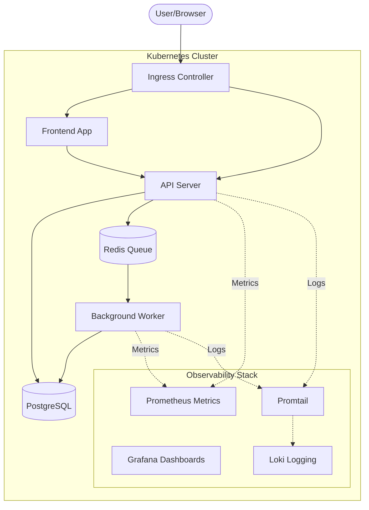

# Goal Description

This document outlines the architecture for a cloud-native SaaS application designed specifically to serve as a robust DevOps and Site Reliability Engineering (SRE) sandbox. The goal is to keep the application logic simple while implementing production-grade infrastructure, observability, and CI/CD practices.

**Project Idea:** "TaskFlow" - A background job and task processing platform. Users can submit "tasks" (e.g., generating a report, resizing an image, or sending emails), which are placed in a queue and processed asynchronously by background workers. This naturally necessitates a multi-tier architecture, a database, a message broker, and provides excellent opportunities for simulating SRE failure scenarios like queue backups and worker crashes.

## Architecture Diagram



## System Components & Tech Stack

1.  **Frontend Service**:
    *   **Tech**: React (Vite) + Nginx (for serving static files).
    *   **Role**: Provides a simple UI for users to create tasks and view their real-time status.

2.  **API Server (Backend)**:
    *   **Tech**: Golang (Gin/Fiber) or Node.js (Express). *Recommendation: Golang is widely used in SRE/Cloud-Native environments and has excellent native Prometheus libraries.*
    *   **Role**: Handles REST API requests, writes tasks to the database, and pushes job messages to the Redis queue. Includes `/healthz` and `/metrics` endpoints.

3.  **Worker Service**:
    *   **Tech**: Python (Celery) or Golang.
    *   **Role**: Consumes jobs from Redis, simulates processing (e.g., sleep, random failures), and updates the job status in PostgreSQL.

4.  **Database**:
    *   **Tech**: PostgreSQL.
    *   **Role**: Persistent storage for users, task metadata, and job statuses.

5.  **Cache/Message Broker**:
    *   **Tech**: Redis.
    *   **Role**: Acts as the asynchronous job queue for the background workers.

6.  **Observability & Infrastructure**:
    *   **Orchestration**: Kubernetes (Minikube, Kind, or Cloud managed like EKS/GKE).
    *   **Metrics**: Prometheus & Grafana (via kube-prometheus-stack).
    *   **Logging**: Loki + Promtail (or Fluent Bit).
    *   **CI/CD**: GitHub Actions (CI) + ArgoCD (GitOps CD).

## Data Flow

1.  **Task Creation**: The user submits a new task via the Frontend. The request hits the API Server.
2.  **Storage & Queuing**: The API Server saves the task as "Pending" in PostgreSQL and pushes a job payload to the Redis queue.
3.  **Processing**: The Worker continuously polls Redis, picks up the job, and begins processing.
4.  **Completion**: Upon success (or failure), the Worker updates the task status in PostgreSQL to "Completed" or "Failed".
5.  **Monitoring**: Throughout this process, Prometheus scrapes metrics (request latency, queue length, memory usage) from the API and Worker, while Promtail ships stdout logs to Loki.

## SRE Failure Scenarios (To Be Simulated)

This architecture is designed to allow intentional chaos engineering to test alerts, metrics, and recovery playbooks:

1.  **High Latency (The "Slow DB" Simulation)**: Add a hidden endpoint in the API Server that deliberately adds a 3-5 second delay to responses. This will trigger Prometheus alerts for "High p99 Latency."
2.  **Memory Leak / OOMKill**: Create an endpoint that allocates memory without releasing it until the Kubernetes Pod hits its memory limit and is killed (OOMKilled). Demonstrates self-healing and pod restart alerts.
3.  **Queue Backup**: Pause the Worker deployment. The Redis queue will start filling up. This triggers a "High Queue Depth" alert and can be used to demonstrate Horizontal Pod Autoscaling (HPA) via metrics (e.g., using KEDA).
4.  **Database Connection Loss**: Rotate the database credentials or change the Kubernetes NetworkPolicy to block traffic to Postgres. Demonstrates error rate spikes and log parsing for connection timeouts.

## Folder / Project Structure

A monorepo approach is recommended for managing all services and infrastructure in one place:

```text
taskflow-sre-sandbox/
├── .github/
│   └── workflows/          # CI pipelines (build/test/docker push)
├── apps/
│   ├── frontend/           # React application
│   ├── api-server/         # Backend API
│   └── worker/             # Background processor
├── infra/
│   ├── k8s/
│   │   ├── base/           # Base Kubernetes manifests (Deployments, Services)
│   │   └── overlays/       # Environment specific configs (dev, prod)
│   └── argocd/             # ArgoCD Application manifests for GitOps
├── observability/
│   ├── dashboards/         # Exported Grafana JSON dashboards
│   └── alerts/             # Prometheus alert rules (YAML)
├── scripts/                # Helper scripts (e.g., load-test.sh)
├── docker-compose.yml      # Local development alternative to K8s
└── README.md
```

## User Review Required

> [!IMPORTANT]
> Please review the proposed architecture and provide feedback on the following:
> 1. **Tech Stack Preferences**: Do you have a preference for the programming languages used in the API Server (Node.js vs. Go) and Worker (Python vs. Go)?
> 2. **Infrastructure Complexity**: We are starting with plain Kubernetes manifests. Would you prefer to introduce Helm charts or Terraform right away?
> 3. **Project Idea**: Does the "TaskFlow" (API + Background Worker) concept fit what you envision, or would you prefer a traditional E-commerce simulation?

## Verification Plan

### Automated Tests
- Once the plan is approved, we will initialize the workspace with the defined directory structure.
- We will set up initial scaffolding and `Dockerfiles` for the frontend, api-server, and worker, ensuring they can build successfully.

### Manual Verification
- You will be able to review the repository layout and the initial Kubernetes manifests we generate to ensure they align with standard SRE best practices.
